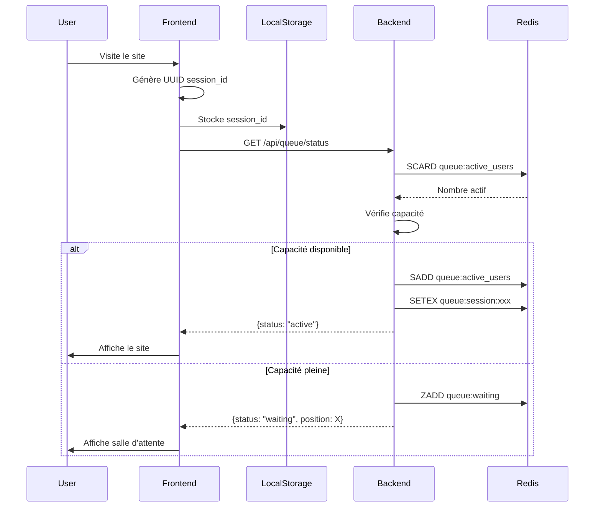
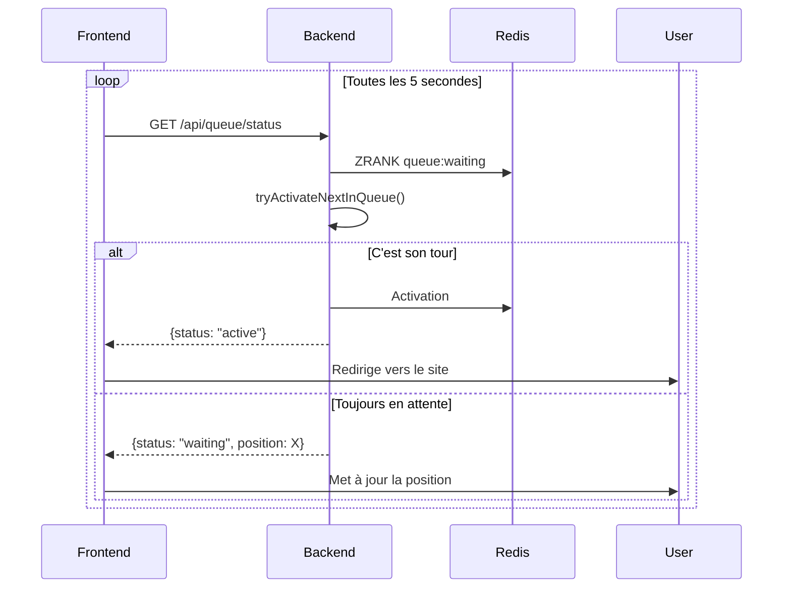
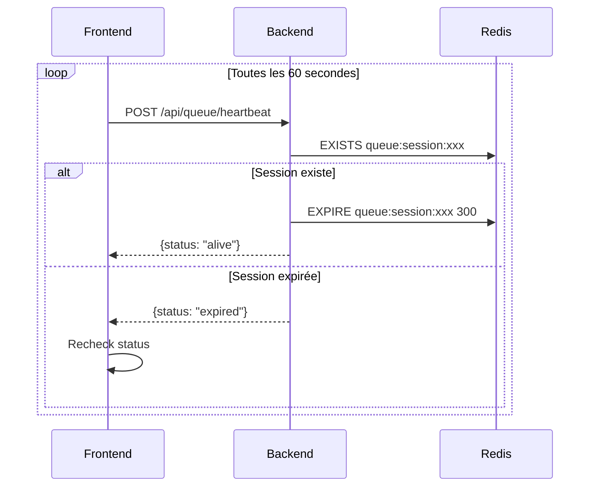
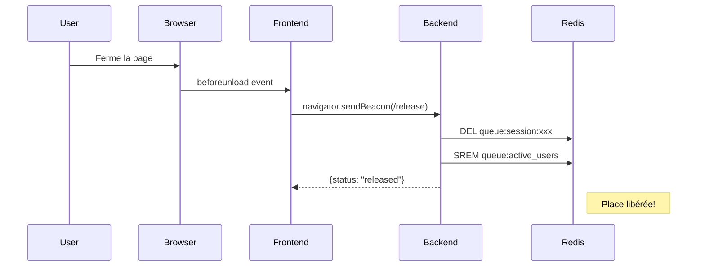

# CLAUDE.md - Documentation Technique du Projet

## 🤖 Projet Généré par Claude

Ce projet a été entièrement conçu et développé avec l'assistance de Claude, l'assistant IA d'Anthropic.

---

## 📋 Table des Matières

1. [Vue d'Ensemble](#vue-densemble)
2. [Architecture du Système](#architecture-du-système)
3. [Système de File d'Attente](#système-de-file-dattente)
4. [Stack Technique](#stack-technique)
5. [Structure des Fichiers](#structure-des-fichiers)
6. [Flux de Données](#flux-de-données)
7. [API Endpoints](#api-endpoints)
8. [Configuration](#configuration)
9. [Sécurité](#sécurité)
10. [Scalabilité](#scalabilité)

---

## 🎯 Vue d'Ensemble

### Objectif du Projet

Créer une plateforme e-commerce capable de gérer un trafic très élevé en implémentant un système de file d'attente virtuelle qui :
- Limite le nombre d'utilisateurs simultanés sur le site
- Offre une expérience utilisateur transparente en salle d'attente
- Gère automatiquement les sessions et la rotation des utilisateurs
- Fournit des statistiques en temps réel

### Problème Résolu

Lors d'événements à fort trafic (ventes flash, lancements de produits), les sites e-commerce peuvent subir :
- Surcharge du serveur → crashes
- Mauvaise expérience utilisateur → frustration
- Perte de ventes → impact financier

**Solution** : Un système de file d'attente qui régule l'accès au site tout en maintenant une expérience utilisateur professionnelle.

---

## 🏗️ Architecture du Système

### Architecture Globale

```
┌─────────────────────────────────────────────────────────────────┐
│                         UTILISATEURS                             │
└────────────────────────┬────────────────────────────────────────┘
                         │
                         ▼
┌─────────────────────────────────────────────────────────────────┐
│                    NEXT.JS FRONTEND (Port 3000)                 │
│  ┌──────────────┐  ┌──────────────┐  ┌─────────────────────┐   │
│  │  useQueue    │  │  Waiting     │  │   Product List      │   │
│  │  Hook        │  │  Room        │  │   Component         │   │
│  └──────────────┘  └──────────────┘  └─────────────────────┘   │
└────────────────────────┬────────────────────────────────────────┘
                         │ HTTP/REST API
                         ▼
┌─────────────────────────────────────────────────────────────────┐
│                  LARAVEL BACKEND (Port 8000)                    │
│  ┌──────────────────────────────────────────────────────────┐   │
│  │              Queue Middleware                            │   │
│  │  • Vérifie le nombre d'utilisateurs actifs              │   │
│  │  • Gère l'accès ou la mise en file d'attente            │   │
│  └──────────────────────────────────────────────────────────┘   │
│  ┌──────────────────────────────────────────────────────────┐   │
│  │              Queue Controller                            │   │
│  │  • status()    • heartbeat()   • release()              │   │
│  │  • stats()     • cleanup()                              │   │
│  └──────────────────────────────────────────────────────────┘   │
└────────────────────────┬───────────────────┬────────────────────┘
                         │                   │
         ┌───────────────┴──────┐   ┌────────┴──────────┐
         ▼                      ▼   ▼                    ▼
┌─────────────────┐    ┌──────────────────┐    ┌────────────────┐
│  REDIS          │    │  MYSQL           │    │  Queue Worker  │
│  • Cache        │    │  • Products      │    │  • Jobs        │
│  • Sessions     │    │  • Users         │    │  • Processing  │
│  • Queue Data   │    │  • Orders        │    │                │
└─────────────────┘    └──────────────────┘    └────────────────┘
```

### Composants Principaux

#### 1. **Frontend (Next.js + TypeScript)**
- **Rôle** : Interface utilisateur et gestion de l'expérience
- **Responsabilités** :
  - Génération et stockage du `session_id`
  - Polling de la position dans la file
  - Affichage de la salle d'attente ou du site
  - Envoi du heartbeat pour maintenir la session
  - Libération de la session au départ

#### 2. **Backend (Laravel)**
- **Rôle** : Logique métier et contrôle d'accès
- **Responsabilités** :
  - Vérification de la capacité disponible
  - Gestion de la file d'attente dans Redis
  - Activation/désactivation des sessions
  - API RESTful pour le frontend
  - Nettoyage des sessions expirées

#### 3. **Redis**
- **Rôle** : Stockage rapide et gestion de la file
- **Structures utilisées** :
  - `SET` : Utilisateurs actifs
  - `SORTED SET` : File d'attente avec timestamps
  - `STRING` : Sessions avec TTL

#### 4. **MySQL**
- **Rôle** : Persistance des données
- **Tables** : Produits, utilisateurs, commandes, etc.

---

## 🚦 Système de File d'Attente

### Structures Redis

#### 1. Active Users Set
```redis
Key: queue:active_users
Type: SET
Usage: Stocker les session_id des utilisateurs actifs
Commands:
  - SADD queue:active_users <session_id>
  - SREM queue:active_users <session_id>
  - SCARD queue:active_users  # Compter les actifs
```

#### 2. Waiting Queue
```redis
Key: queue:waiting
Type: SORTED SET
Score: timestamp (pour FIFO)
Usage: File d'attente ordonnée
Commands:
  - ZADD queue:waiting <timestamp> <session_id>
  - ZRANK queue:waiting <session_id>  # Position
  - ZRANGE queue:waiting 0 0  # Premier en file
  - ZREM queue:waiting <session_id>
```

#### 3. User Sessions
```redis
Key: queue:session:<session_id>
Type: STRING
TTL: 300 seconds (5 minutes)
Value: timestamp de création
Usage: Vérifier si session active et auto-expiration
```

### Algorithme de Gestion

#### Flux d'Entrée d'un Utilisateur

```
1. Utilisateur arrive sur le site
   ↓
2. Frontend génère/récupère session_id
   ↓
3. Appel GET /api/queue/status
   ↓
4. Middleware vérifie:
   - Session existe déjà ? → AUTORISER + refresh TTL
   - Sinon, capacité disponible ?
     ├─ OUI → ACTIVER session
     └─ NON → AJOUTER à la file
   ↓
5. Frontend reçoit:
   - status: "active" → Affiche le site
   - status: "waiting" → Affiche la salle d'attente
   ↓
6. Si "waiting":
   - Poll toutes les 5 secondes
   - Vérifie si c'est son tour
   ↓
7. Si "active":
   - Heartbeat toutes les 60 secondes
   - Navigation normale sur le site
```

#### Activation d'un Utilisateur en File

```python
def tryActivateNextInQueue(sessionId):
    activeUsers = SCARD('queue:active_users')
    maxUsers = CONFIG['max_concurrent_users']

    if activeUsers >= maxUsers:
        return False

    # Récupérer le premier en file
    nextUser = ZRANGE('queue:waiting', 0, 0)[0]

    if nextUser != sessionId:
        return False  # Pas ton tour

    # Activer l'utilisateur
    SADD('queue:active_users', sessionId)
    SETEX('queue:session:' + sessionId, 300, timestamp())
    ZREM('queue:waiting', sessionId)

    return True
```

#### Libération d'une Session

```python
def releaseSession(sessionId):
    DEL('queue:session:' + sessionId)
    SREM('queue:active_users', sessionId)
    ZREM('queue:waiting', sessionId)

    # Place libérée pour le suivant !
```

### Estimation du Temps d'Attente

```javascript
// Formule simple
estimatedWaitSeconds = position * 30  // 30 sec par personne

// Formule avancée (peut être implémentée)
averageSessionDuration = calculateAverageSessionTime()
estimatedWaitSeconds = (position * averageSessionDuration) / maxConcurrentUsers
```

---

## 💻 Stack Technique

### Backend

| Technologie | Version | Rôle |
|-------------|---------|------|
| Laravel | 10.x | Framework PHP |
| PHP | 8.2 | Langage backend |
| Predis | 2.x | Client Redis pour PHP |
| MySQL | 8.0 | Base de données relationnelle |
| Redis | 7.x | Cache et file d'attente |

### Frontend (Modernisé - 2025)

| Technologie | Version | Rôle |
|-------------|---------|------|
| **Next.js** | **16.0** | Framework React avec App Router & **Turbopack** |
| **React** | **19.0** | Librairie UI avec **React Compiler** |
| **TypeScript** | **5.7** | Typage statique |
| **Native Fetch API** | Built-in | Client HTTP (**NO external libraries**) |
| **TanStack Query** | 5.62 | Data fetching & cache management |
| **React Hook Form** | 7.54 | Gestion des formulaires performante |
| **Zod** | 3.24 | Validation de schémas type-safe |
| **shadcn/ui** | Latest | Composants UI avec Radix UI |
| **Tailwind CSS** | 3.4 | Framework CSS utilitaire |
| **Sonner** | 1.7 | Toast notifications |
| **UUID** | 11.x | Génération d'identifiants |

### Nouveautés 2025

- ⚡ **Turbopack Stable** : Bundler 5-10x plus rapide que Webpack
- 🚀 **React Compiler** : Optimisation automatique sans memo/useMemo
- 🎯 **Native Fetch** : Aucune dépendance HTTP externe (axios supprimé)
- 📦 **Type Aliases** : Utilisation exclusive de `type` au lieu d'`interface`
- 🔄 **Server Actions** : Mutations côté serveur type-safe
- 💾 **Cache Tags** : Invalidation granulaire avec Next.js 16

### DevOps

| Technologie | Rôle |
|-------------|------|
| Docker | Conteneurisation |
| Docker Compose | Orchestration |
| Git | Versioning |

---

## 📂 Structure des Fichiers

### Backend Laravel

```
backend/
├── app/
│   ├── Http/
│   │   ├── Controllers/
│   │   │   └── QueueController.php         # API de gestion de file
│   │   └── Middleware/
│   │       └── QueueMiddleware.php         # Contrôle d'accès
│   ├── Models/                              # (à développer)
│   └── Jobs/                                # (à développer)
├── bootstrap/
│   └── app.php                              # Bootstrap Laravel
├── config/
│   ├── queue.php                            # Configuration queue
│   ├── database.php                         # Configuration DB
│   └── cors.php                             # Configuration CORS
├── routes/
│   ├── api.php                              # Routes API
│   └── web.php                              # Routes web
├── public/
│   └── index.php                            # Point d'entrée
├── .env.example                             # Variables d'environnement
├── composer.json                            # Dépendances PHP
└── Dockerfile                               # Image Docker
```

### Frontend Next.js

```
frontend/
├── src/
│   ├── app/
│   │   ├── layout.tsx                      # Layout principal
│   │   ├── page.tsx                        # Page d'accueil
│   │   └── globals.css                     # Styles globaux
│   ├── components/
│   │   ├── QueueWaitingRoom.tsx           # Salle d'attente
│   │   └── ProductList.tsx                # Liste de produits
│   ├── hooks/
│   │   └── useQueue.ts                    # Hook de gestion queue
│   └── lib/
│       └── api.ts                         # Client API
├── public/                                 # Assets statiques
├── package.json                           # Dépendances npm
├── tsconfig.json                          # Config TypeScript
├── tailwind.config.js                     # Config Tailwind
├── next.config.js                         # Config Next.js
└── Dockerfile                             # Image Docker
```

---

## 🔄 Flux de Données

### 1. Initialisation de Session



### 2. Polling en Salle d'Attente



### 3. Maintien de Session Active



### 4. Libération de Session



---

## 🔌 API Endpoints

### 1. Queue Status

```http
GET /api/queue/status?session_id={uuid}
Headers: X-Session-Id: {uuid}
```

**Réponse si actif :**
```json
{
  "status": "active",
  "active_users": 95,
  "max_users": 100
}
```

**Réponse si en attente :**
```json
{
  "status": "waiting",
  "position": 15,
  "queue_length": 50,
  "estimated_wait_seconds": 450,
  "active_users": 100,
  "max_users": 100
}
```

### 2. Heartbeat

```http
POST /api/queue/heartbeat
Headers: X-Session-Id: {uuid}
Body: {"session_id": "{uuid}"}
```

**Réponse :**
```json
{
  "status": "alive"
}
```

### 3. Release Session

```http
POST /api/queue/release
Headers: X-Session-Id: {uuid}
Body: {"session_id": "{uuid}"}
```

**Réponse :**
```json
{
  "status": "released"
}
```

### 4. Statistics (Admin)

```http
GET /api/queue/stats
```

**Réponse :**
```json
{
  "active_users": 87,
  "waiting_users": 23,
  "max_concurrent_users": 100,
  "queue_enabled": true
}
```

### 5. Cleanup (Admin/Cron)

```http
POST /api/queue/cleanup
```

**Réponse :**
```json
{
  "cleaned": 5,
  "message": "Cleaned up 5 expired sessions"
}
```

### 6. Products (Protected)

```http
GET /api/products
Headers: X-Session-Id: {uuid}
```

**Réponse si autorisé :**
```json
{
  "products": [
    {"id": 1, "name": "Product 1", "price": 99.99},
    {"id": 2, "name": "Product 2", "price": 149.99}
  ]
}
```

**Réponse si en file (429) :**
```json
{
  "queued": true,
  "position": 10,
  "estimated_wait_seconds": 300,
  "message": "Too many users. You are in the waiting queue."
}
```

---

## ⚙️ Configuration

### Variables d'Environnement Backend

```bash
# Application
APP_NAME="E-Commerce Queue"
APP_ENV=local
APP_DEBUG=true
APP_URL=http://localhost:8000

# Database
DB_CONNECTION=mysql
DB_HOST=mysql
DB_PORT=3306
DB_DATABASE=ecommerce
DB_USERNAME=root
DB_PASSWORD=secret

# Redis
REDIS_HOST=redis
REDIS_PORT=6379
CACHE_DRIVER=redis
QUEUE_CONNECTION=redis
SESSION_DRIVER=redis

# Queue Configuration
QUEUE_ENABLED=true
QUEUE_MAX_CONCURRENT_USERS=100
QUEUE_BYPASS_TOKEN=bypass-secret-token

# CORS
FRONTEND_URL=http://localhost:3000
```

### Variables d'Environnement Frontend

```bash
NEXT_PUBLIC_API_URL=http://localhost:8000
```

### Paramètres du Système de Queue

| Paramètre | Localisation | Valeur | Description |
|-----------|--------------|--------|-------------|
| `SESSION_TTL` | QueueMiddleware.php | 300s | Durée de vie d'une session active |
| `POLL_INTERVAL` | useQueue.ts | 5000ms | Fréquence de vérification de la file |
| `HEARTBEAT_INTERVAL` | useQueue.ts | 60000ms | Fréquence du heartbeat |
| `WAIT_PER_POSITION` | QueueController.php | 30s | Temps estimé par position |

---

## 🔒 Sécurité

### 1. CORS (Cross-Origin Resource Sharing)

**Configuration** : `backend/config/cors.php`

```php
'allowed_origins' => [env('FRONTEND_URL', 'http://localhost:3000')],
'supports_credentials' => true,
```

**Protection** : Seul le frontend autorisé peut appeler l'API.

### 2. Bypass Token

**Usage** : Permettre aux administrateurs de bypasser la file.

```bash
curl -H "X-Queue-Bypass: bypass-secret-token" \
     http://localhost:8000/api/products
```

**Sécurité** :
- Token stocké dans `.env`
- Ne jamais commiter le vrai token
- Utiliser un token fort en production

### 3. Session Expiration

**Mécanisme** : TTL automatique dans Redis (300s).

**Avantages** :
- Pas de sessions zombies
- Libération automatique des places
- Pas besoin de cron pour nettoyer

### 4. Rate Limiting (À implémenter)

**Recommandation** : Ajouter un rate limiting sur les endpoints :

```php
Route::middleware(['throttle:60,1'])->group(function () {
    Route::get('/queue/status', [QueueController::class, 'status']);
});
```

### 5. Input Validation

**Actuel** : Validation basique des session_id.

**À améliorer** :
```php
$request->validate([
    'session_id' => 'required|uuid'
]);
```

---

## 📈 Scalabilité

### Limitations Actuelles

| Aspect | Limite | Raison |
|--------|--------|--------|
| Redis Single Instance | ~10k users | Pas de cluster Redis |
| Laravel Single Instance | ~1k req/s | Pas de load balancing |
| Session Storage | RAM only | Pas de persistance Redis |

### Améliorations Possibles

#### 1. **Redis Cluster**

```yaml
# docker-compose.yml
redis-master:
  image: redis:7-alpine

redis-replica-1:
  image: redis:7-alpine
  command: redis-server --slaveof redis-master 6379

redis-replica-2:
  image: redis:7-alpine
  command: redis-server --slaveof redis-master 6379
```

#### 2. **Load Balancer Nginx**

```nginx
upstream backend {
    server backend-1:8000;
    server backend-2:8000;
    server backend-3:8000;
}

server {
    listen 80;
    location / {
        proxy_pass http://backend;
    }
}
```

#### 3. **Horizontal Scaling**

```yaml
# docker-compose.yml
backend:
  deploy:
    replicas: 3

queue_worker:
  deploy:
    replicas: 5
```

#### 4. **CDN pour Frontend**

- Déployer Next.js sur Vercel/Netlify
- Assets statiques sur CDN
- Réduction de la charge serveur

#### 5. **Redis Persistence**

```conf
# redis.conf
save 900 1
save 300 10
save 60 10000

appendonly yes
appendfsync everysec
```

#### 6. **Database Optimization**

```sql
-- Index sur les tables fréquemment requêtées
CREATE INDEX idx_product_active ON products(active);
CREATE INDEX idx_order_status ON orders(status);
```

### Architecture Scalable

```
                    ┌──────────────┐
                    │     CDN      │
                    └──────┬───────┘
                           │
                    ┌──────▼───────┐
                    │ Load Balancer│
                    └──────┬───────┘
                           │
        ┌──────────────────┼──────────────────┐
        │                  │                  │
   ┌────▼─────┐      ┌────▼─────┐      ┌────▼─────┐
   │Backend #1│      │Backend #2│      │Backend #3│
   └────┬─────┘      └────┬─────┘      └────┬─────┘
        │                  │                  │
        └──────────────────┼──────────────────┘
                           │
        ┌──────────────────┼──────────────────┐
        │                  │                  │
   ┌────▼─────┐      ┌────▼─────┐      ┌────▼─────┐
   │  Redis   │      │  MySQL   │      │  Queue   │
   │ Cluster  │      │ Primary  │      │ Workers  │
   └──────────┘      └────┬─────┘      └──────────┘
                           │
                    ┌──────▼───────┐
                    │MySQL Replica │
                    └──────────────┘
```

---

## 🧪 Tests et Monitoring

### Tests de Charge Recommandés

#### 1. **Apache Bench**

```bash
# Tester 1000 requêtes, 50 concurrentes
ab -n 1000 -c 50 http://localhost:8000/api/queue/status?session_id=test
```

#### 2. **Artillery.io**

```yaml
# artillery.yml
config:
  target: 'http://localhost:8000'
  phases:
    - duration: 60
      arrivalRate: 100
scenarios:
  - flow:
    - get:
        url: "/api/queue/status?session_id={{ $uuid }}"
```

#### 3. **K6**

```javascript
// k6-test.js
import http from 'k6/http';
import { check } from 'k6';

export let options = {
  vus: 100,
  duration: '60s',
};

export default function() {
  let res = http.get('http://localhost:8000/api/queue/status');
  check(res, { 'status was 200': (r) => r.status == 200 });
}
```

### Monitoring

#### Redis Monitoring

```bash
# Se connecter à Redis
docker-compose exec redis redis-cli

# Commandes utiles
INFO stats
INFO memory
MONITOR
SLOWLOG get 10

# Vérifier les clés
KEYS queue:*
SMEMBERS queue:active_users
ZRANGE queue:waiting 0 -1 WITHSCORES
```

#### Laravel Logs

```bash
# Logs en temps réel
docker-compose logs -f backend

# Logs du queue worker
docker-compose logs -f queue_worker
```

#### Metrics à Surveiller

| Métrique | Commande | Seuil Critique |
|----------|----------|----------------|
| Active Users | `SCARD queue:active_users` | > 90% de max |
| Queue Length | `ZCARD queue:waiting` | > 1000 |
| Redis Memory | `INFO memory` | > 80% |
| API Response Time | Logs Laravel | > 200ms |

---

## 🚀 Déploiement en Production

### Checklist Pre-Production

- [ ] Changer `APP_ENV=production`
- [ ] Désactiver `APP_DEBUG=false`
- [ ] Générer `APP_KEY` fort
- [ ] Configurer un `QUEUE_BYPASS_TOKEN` complexe
- [ ] Activer HTTPS
- [ ] Configurer Redis persistence
- [ ] Mettre en place backups MySQL
- [ ] Configurer monitoring (Sentry, New Relic)
- [ ] Tests de charge
- [ ] Documentation API (Swagger)
- [ ] Plan de rollback

### Variables de Production

```bash
# Backend
APP_ENV=production
APP_DEBUG=false
APP_KEY=base64:XXXXXXXXXXXXX
QUEUE_MAX_CONCURRENT_USERS=5000
REDIS_PASSWORD=strong-redis-password
DB_PASSWORD=strong-db-password

# Frontend
NEXT_PUBLIC_API_URL=https://api.votresite.com
```

---

## 📚 Ressources et Références

### Documentation Officielle

- [Laravel Documentation](https://laravel.com/docs)
- [Next.js Documentation](https://nextjs.org/docs)
- [Redis Documentation](https://redis.io/documentation)
- [Tailwind CSS](https://tailwindcss.com/docs)

### Concepts Utilisés

- **Queue System** : Système FIFO (First In First Out)
- **Session Management** : Gestion d'état avec Redis
- **TTL (Time To Live)** : Expiration automatique
- **Polling** : Vérification périodique d'état
- **Heartbeat** : Signal de vie périodique
- **CORS** : Sécurité cross-origin
- **REST API** : Architecture RESTful

### Patterns de Design

- **Middleware Pattern** : Contrôle d'accès
- **Repository Pattern** : (à implémenter pour les models)
- **Service Layer** : (à implémenter pour la logique métier)
- **Custom Hooks** : React hooks personnalisés

---

## 🤝 Contribution

### Comment Étendre le Projet

#### Ajouter un Nouveau Endpoint

1. **Backend** : Créer une méthode dans `QueueController.php`
2. **Route** : Ajouter dans `routes/api.php`
3. **Frontend** : Ajouter dans `lib/api.ts`
4. **Hook** : Utiliser dans un composant

#### Ajouter une Nouvelle Fonctionnalité

1. Planifier l'architecture
2. Modifier le backend si nécessaire
3. Mettre à jour le frontend
4. Tester en local
5. Documenter dans CLAUDE.md
6. Commiter et pusher

---

## 📝 Notes de Développement

### Choix Techniques

#### Pourquoi Redis ?
- **Rapidité** : Opérations en mémoire (< 1ms)
- **Atomicité** : SADD, ZADD sont atomiques
- **TTL natif** : Expiration automatique
- **Structures de données** : SET, SORTED SET parfaits pour la queue

#### Pourquoi Next.js ?
- **SSR** : Améliore le SEO
- **Fast Refresh** : Meilleure DX
- **TypeScript** : Type safety
- **App Router** : Architecture moderne

#### Pourquoi Laravel ?
- **Mature** : Framework éprouvé
- **Redis Support** : Excellent support Predis
- **Middleware** : Système de middleware puissant
- **Queue Jobs** : Support natif des queues

### Défis Rencontrés et Solutions

#### 1. Session Expiration
**Problème** : Comment nettoyer les sessions inactives ?
**Solution** : TTL Redis automatique + heartbeat

#### 2. Race Conditions
**Problème** : Deux utilisateurs activés en même temps
**Solution** : Opérations atomiques Redis (SADD, ZADD)

#### 3. Libération au Départ
**Problème** : `beforeunload` pas fiable
**Solution** : `navigator.sendBeacon` + cleanup périodique

#### 4. Position en Temps Réel
**Problème** : Utilisateurs veulent voir leur progression
**Solution** : Polling + calcul de position via ZRANK

---

## 🎓 Apprentissages Clés

### Pour Développeurs Junior

1. **Redis n'est pas qu'un cache** : Structures de données puissantes
2. **TTL est votre ami** : Évite le garbage collection manuel
3. **Polling vs WebSockets** : Polling suffit pour cette use case
4. **UX en salle d'attente** : Transparence = satisfaction utilisateur
5. **Docker facilite le dev** : Même environnement partout

### Pour Architectes

1. **Scalabilité verticale vs horizontale** : Penser horizontal dès le début
2. **State management** : Redis excellent pour state distribué
3. **Graceful degradation** : Système fonctionne même si Redis lent
4. **Monitoring crucial** : Impossible d'optimiser sans métriques
5. **Documentation = code** : CLAUDE.md aussi important que le code

---

## 🔮 Roadmap Future

### Phase 1 - Fonctionnalités (Court Terme)
- [ ] Page d'administration pour visualiser la file
- [ ] Système de priorité (VIP bypass)
- [ ] Notifications push quand c'est le tour
- [ ] Analytics et tableaux de bord
- [ ] Tests unitaires et d'intégration

### Phase 2 - Performance (Moyen Terme)
- [ ] Redis Cluster
- [ ] Load Balancer
- [ ] CDN pour assets
- [ ] Optimisation des requêtes DB
- [ ] Caching agressif

### Phase 3 - Échelle (Long Terme)
- [ ] Multi-région
- [ ] Kubernetes orchestration
- [ ] Monitoring avancé (Prometheus)
- [ ] Auto-scaling
- [ ] Disaster recovery

---

## 📞 Support et Contact

Pour toute question sur ce projet :

1. Consulter le README.md
2. Vérifier ce fichier CLAUDE.md
3. Examiner le code source
4. Tester en local avec Docker

---

## ✨ Crédits

**Généré par** : Claude (Anthropic)
**Date** : 2025
**License** : MIT
**Stack** : Laravel + Next.js + Redis + MySQL + Docker

---

**Note Finale** : Ce fichier CLAUDE.md est une documentation technique complète. Il doit être maintenu à jour avec chaque modification majeure du système.
